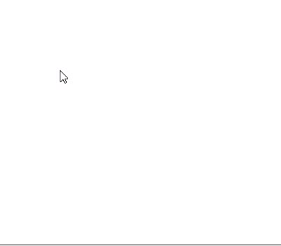

<p align="center"></p>
<p align="center">
Make your canvas sketchable with less than 3.9KB library!
  </p>
<p align="center"></p>

## Installation

You can download the both versions of the library (production and developement) from [here](https://github.com/mhmdkrmabd/sketchablejs/releases/).

After that step, include the library by using the `script` tag:

```javascript
<script src="sketchablejs-1.0.0.min.js" charset="utf-8"></script>
```

Or, you can add this line at the very end of the library file:

```javascript
module.exports = Sketchable;
```

Then, import the library anywhere in your code:

```javascript
const Sketchable = require('./sketchablejs-1.0.0.min.js');
```

Now you can make a sketchable canvas:

```javascript
let canvas = document.getElementById("canvas");
var sketch = new Sketchable(canvas);
```

Piece of cake 🎂!


## Constructor Parameters

The constructor takes two main parameters: the first one is the `canvas` element, which is a mandatory parameter, the other one is the `options`, and it's an optional.

```javascript
var sketch = new Sketchable(Canvas, ?Options);
```

The options are:

- **width**: the width of the canvas (default is the canvas width).

- **height**: the height of the canvas (default is the canvas height).

- **penSize**: the size of the drawing pen (minimum value is `1`, default is `2`).

- **penColor**: the color of the drawing pen (HEX, RGB, and color name are acceptable, default is `#000`).

- **penType**: the type of the drawing pen (acceptable values are  `round`, `butt`and `square`, default is `round`).

- **backgroundColor**: the background color of the canvas (acceptable values as the penColor, default is `#fff`).

```javascript
var canvas = document.getElementById("canvas");
let options = {
  width: 500,
  height: 500,
  penSize: 2,
  penColor: "#000",
  penType: "round",
  backgroundColor: "#fff"  
};
var sketch = new Sketchable(canvas, options);
```

## Public Methods

| Name                  | Description                                                                       | Code                                            |
| --------------------- | --------------------------------------------------------------------------------- | ----------------------------------------------- |
| redraw                | Redraw the sketch board (canvas) draws.                                           | `redraw(?Animation, ?Speed, ?CallbackFunction)` |
| stopRedrawAnimation   | Stop the redrawing operation with animation and redraw without it.                | `stopRedrawAnimation()`                         |
| undo                  | Undo, delete the last draw.                                                       | `undo(?Inner)`                                  |
| redo                  | Redo, recover the last deleted draw.                                              | `redo(?Inner)`                                  |
| clear                 | Clear the sketch board.                                                           | `clear(?Everything)`                            |
| returnToDefaults      | Return to the default values for the drawing pen and the sketch board background. | `returnToDefaults()`                            |
| export                | Export the entire sketch board as JSON to string format.                          | `export()`                                      |
| import                | Import an exported sketch board.                                                  | `import(DrawsJSON)`                             |
| changeBackgroundColor | Change the background color of the sketch board.                                  | `changeBackgroundColor(Color)`                  |
| penSize               | Change the drawing pen size.                                                      | `penSize(Size)`                                 |
| penColor              | Change the drawing pen color.                                                     | `penColor(Color)`                               |
| penType               | Change the drawing pen type                                                       | `penType(Type)`                                 |
| listAttriubtes        | Get all the available attributes of the sketchable object.                        | `listAttriubtes()`                              |

### redraw

Use this method to redraw the sketch board, for example, after clearing it. You can immediately redraw or animate the redrawing process with a controlled speed and a callback function when the animation finish.

```javascript
sketch.redraw(?Animation, ?Speed, ?CallbackFunction);
```

Paramters are:

- **Animation**: whether or not animate the redrawing process (default is `false`).

- **Speed**: the speed of the animation between each draw (minimum value is `1`, default is `15`).

- **CallbackFunction**: trigger a function when the redrawing process finish.

```javascript
// Redraw without animation and no callback function
sketch.redraw();

// Redraw with animation, and 10ms speed between each draw
sketch.redraw(true, 10);

// Redraw with animation, 10ms speed, and predefined callback function
function f() {
    console.log("Animation done.")
}
sketch.redraw(true, 10, f);
```

### stopRedrawAnimation

This method will stop the redrawing animation process, at any stage, and immediately redraw the sketch board.

```javascript
// Stop the redrawing animation
sketch.stopRedrawAnimation();
```

### undo, redo

You can undo (delete) the last draw by calling the `undo` method, while `redo`, by contrast, will recover the last deleted draw.

```javascript
sketch.undo(?Inner);

sketch.redo(?Inner);
```

Note that both methods take an optional parameter called `Inner`, this parameter is not for public use but inner purpose; so you don't have to (or, it's better to not) call those two methods with a given parameter.

```javascript
// Undo the last draw
sketch.undo();

// Redo the last deleted draw
sketch.redo();
```

### clear

By calling this method, you can erase all the sketch board draws.

```javascript
sketch.clear(?Everything);
```

It takes only one parameter called `Everything`; this parameter determines whether or not empty the saved draws. It's by default set to true; in that case the redraw method will not draw anything, neither the export method will export anything, but if the parameter set to false, the sketch board will be cleared, but all the draws will still saved, exported and redrawn alongside the new ones.

```javascript
// Clear the sketch board, and the saved draws
sketch.clear();

// Clear the sketch board only, keep the saved draws
sketch.clear(false);
```

### returnToDefaults

```javascript
sketch.returnToDefaults();
```

This method will return the drawing pen attributes and the background color of the sketch board back to the default values.

```javascript
// Return pen and sketch board background to default values
sketch.returnToDefaults();
/*
Pen size = 2
Pen color = "#000
Pen type = "round"
Background color = "#fff"
*/
```

### import, export

You can, by using those methods, `export` the entire sketch board in a JSON to string form, and `import` it later. Note that the `export` method takes the background color into account.

```javascript
sketch.export();

sketch.import(DrawsJSON);
```

```javascript
// Export the sketch board
sketch.export();

// Import a sketch board
var saved = '{...';
sketch.import(saved);
```

Also, note that when importing draws, you can redraw them, animate them, add new ones, redo, undo, etc. It's a powerful technique.

### changeBackgroundColor, penSize, penColor, penType

By using those methods, you're able to change the background color of the sketch board, change the drawing pen size, type, and color.

```javascript
sketch.changeBackgroundColor(Color);

sketch.penSize(Size);

sketch.penColor(Color);

sketch.penType(Type);
```

```javascript
// Change background color
sketch.changeBackgroundColor("white"); // #fff and rgb(255,255,255) are valid

// Change the drawing pen size
sketch.penSize(5);

// Change the drawing pen color
sketch.penColor("red"); // #ff0000 and rgb(255,0,0) are valid


// Change the drawing pen type
// Acceptable values are: "round", "butt" and "square"
sketch.penType("square");
```

### listAttributes

You can use this method to get the attributes of the Sketchable object; like the pen attributes values, how many saved and deleted draws, is the user sketching right now, or the drawing process with animation is running, etc.

```javascript
sketch.listAttributes();
```

The output will be like:

```json
{
  "Dimensions": {
    "Width": 500,
    "Height": 500
  },
  "Pen": {
    "Size": 2,
    "Color": "#000",
    "Type": "round"
  },
  "Draw": {
    "Saved": 60,
    "Deleted": 10
  },
  "Actions": {
    "Sketching": false,
    "Redrawing": false
  },
  "BackgroundColor": "#fff"
}
```

So, if you want to know, for example, how many saved draws are there you can use the method like this:

```javascript
var attributes = sketch.listAttributes();
attributes.Draws.Saved; // 60
```

Or you can get the value directly like this:

```javascript
sketch.listAttributes().Draws.Saved; // 60
```

## License

This library is published under the [MIT Licence](/LICENSE), happy coding 🎉.
